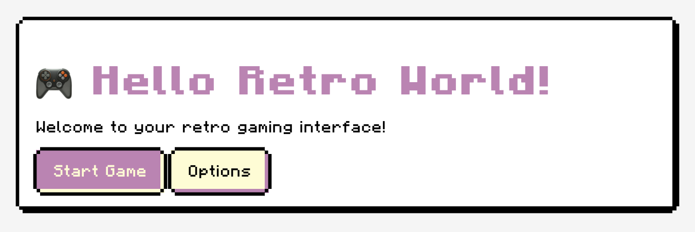

# 🎮 Retro UI

[](https://opensource.org/licenses/MIT)
[](https://github.com)
[](https://github.com)
[](https://github.com)
[](https://github.com)

A pixel-perfect retro gaming UI library that works without any build step! Just include the CSS and optional JavaScript files, and you're ready to create retro-styled interfaces.

## 🙏 Attribution

This vanilla JavaScript implementation was inspired by and ported from the original [RetroUI](https://github.com/Dksie09/RetroUI) React component library created by [@Dksie09](https://github.com/Dksie09). This version provides the same retro gaming aesthetic without requiring React, build tools, or any dependencies - just pure HTML, CSS, and optional JavaScript.

## 🎮 Live Demo

- **[Full Demo](examples/index.html)** - Open `examples/index.html` in your browser
- **[Classless Demo](examples/classless.html)** - Open `examples/classless.html` in your browser
- **[Quick Test](test.html)** - Open `test.html` for a simple functionality test

## 🚀 30-Second Setup

```html
<!DOCTYPE html>
<html lang="en">
<head>
    <link rel="stylesheet" href="css/retro-ui-classless.css">
    <link rel="stylesheet" href="css/retro-ui-components.css">
</head>
<body>
    <main>
        <article>
            <h1>🎮 Hello Retro World!</h1>
            <p>Welcome to your retro gaming interface!</p>
            <button>Start Game</button>
            <button class="secondary">Options</button>
        </article>
    </main>
    <script src="js/retro-ui.js"></script>
</body>
</html>
```

That's it! Pure semantic HTML with automatic retro styling. No npm install, no build process, no configuration files, and **no CSS classes needed**!


*Screenshot showing the retro gaming interface with pixel-perfect styling*

## 🌟 Why Choose Retro UI (Vanilla)?

- **🚀 Instant Setup** - No webpack, no npm install, no build tools needed
- **📦 Zero Dependencies** - Pure vanilla JavaScript and CSS
- **🎯 Framework Agnostic** - Works with React, Vue, Angular, or plain HTML
- **🎮 Authentic Retro Feel** - Pixel-perfect gaming aesthetics
- **♿ Accessibility First** - Screen reader friendly with proper ARIA attributes
- **📱 Responsive Design** - Looks great on all devices
- **⚡ Lightweight** - Combined minified size < 25KB

## ✨ Features

- **🚀 No Build Step Required** - Just include CSS and JS files
- **📦 Zero Dependencies** - Pure vanilla JavaScript and CSS
- **🎨 Highly Customizable** - CSS custom properties for easy theming
- **♿ Accessible** - Built with semantic HTML and ARIA attributes
- **📱 Responsive** - Works on all screen sizes
- **🎯 Framework Agnostic** - Works with any or no framework
- **🎮 Pixel Perfect** - Authentic retro gaming aesthetics

## 🚀 Quick Start

### Installation Options

#### Option 1: Classless Approach (Recommended - Like PicoCSS)

**Pure semantic HTML with automatic styling - no classes needed!**

1. **Download or clone this repository**
2. **Include the classless CSS:**
   ```html
   <!DOCTYPE html>
   <html lang="en">
   <head>
       <link rel="stylesheet" href="css/retro-ui-classless.css">
       <link rel="stylesheet" href="css/retro-ui-components.css">
       <link rel="stylesheet" href="css/retro-ui-utilities.css"> <!-- Optional -->
   </head>
   <body>
       <main>
           <h1>🎮 Hello Retro World!</h1>
           <article>
               <h2>Game Stats</h2>
               <p>Your character information...</p>
               <button>Continue Game</button>
               <button class="secondary">Save Game</button>
           </article>
       </main>
       
       <script src="js/retro-ui.js"></script>
   </body>
   </html>
   ```

#### Option 2: Class-Based Approach (Traditional)

**Explicit class-based styling for more control:**

1. **Download or clone this repository**
2. **Include the class-based CSS:**
   ```html
   <!DOCTYPE html>
   <html lang="en">
   <head>
       <link rel="stylesheet" href="css/retro-ui.css">
       <link rel="stylesheet" href="css/retro-ui-components.css">
   </head>
   <body class="retro-ui">
       <div class="retro-card">
           <h1>🎮 Hello Retro World!</h1>
           <button class="retro-button">Start Game</button>
           <button class="retro-button secondary">Options</button>
       </div>
       
       <script src="js/retro-ui.js"></script>
   </body>
   </html>
   ```

#### Option 3: Use Pre-built Files (Optimized)

**For production use, smaller file sizes:**

```html
<!DOCTYPE html>
<html lang="en">
<head>
    <!-- Classless approach -->
    <link rel="stylesheet" href="dist/retro-ui-classless.min.css">
    
    <!-- OR Class-based approach -->
    <link rel="stylesheet" href="dist/retro-ui.min.css">
</head>
<body>
    <!-- Your content here -->
    
    <script src="dist/retro-ui.min.js"></script>
</body>
</html>
```

#### Option 4: CDN (jsDelivr)

```html
<!-- Classless approach -->
<link rel="stylesheet" href="https://cdn.jsdelivr.net/gh/chriscow/retro-ui@latest/dist/retro-ui-classless.min.css">

<!-- OR Class-based approach -->
<link rel="stylesheet" href="https://cdn.jsdelivr.net/gh/chriscow/retro-ui@latest/dist/retro-ui.min.css">

<script src="https://cdn.jsdelivr.net/gh/chriscow/retro-ui@latest/dist/retro-ui.min.js"></script>
```

*Available immediately after pushing to GitHub!*

### Comparison: Choose Your Style

| **Classless (Semantic)** | **Class-Based (Explicit)** |
|---------------------------|----------------------------|
| `<button>Click me</button>` | `<button class="retro-button">Click me</button>` |
| `<article>Content</article>` | `<div class="retro-card">Content</div>` |
| `<input type="text">` | `<input type="text" class="retro-input">` |
| **Like PicoCSS** | **Like Bootstrap/Tailwind** |
| **Automatic styling** | **Explicit control** |

### Quick Demo

**Live Examples:**
- 🎮 **[Classless Demo](examples/classless.html)** - Pure semantic HTML approach
- 📝 **[Class-Based Demo](examples/index.html)** - Traditional class-based approach  
- ⚡ **[Quick Test](test.html)** - Simple functionality test

### Which Approach Should I Choose?

#### 🎯 **Choose Classless If:**
- You like PicoCSS's approach
- You want minimal HTML
- You prefer semantic markup
- You're building simple to medium projects
- You want to write less CSS classes

#### 🎯 **Choose Class-Based If:**
- You're used to Bootstrap/Tailwind
- You need fine-grained control
- You're integrating with existing class-based systems
- You're building complex applications
- You want explicit styling decisions

## 🎨 Components

### Buttons

```html
<!-- Basic buttons -->
<button class="retro-button">Primary Button</button>
<button class="retro-button secondary">Secondary Button</button>

<!-- Or use data attributes -->
<button data-retro>Primary Button</button>
<button data-retro="secondary">Secondary Button</button>

<!-- Input buttons -->
<input type="button" class="retro-button" value="Input Button">
<input type="submit" class="retro-button" value="Submit">
```

### Cards

```html
<!-- Basic card -->
<div class="retro-card">
    <h3>Card Title</h3>
    <p>Card content goes here...</p>
    <button class="retro-button">Action</button>
</div>

<!-- Semantic HTML -->
<article data-retro>
    <h3>Article Title</h3>
    <p>Article content...</p>
</article>
```

### Form Elements

```html
<!-- Input fields -->
<input type="text" class="retro-input" placeholder="Enter text">
<input type="email" data-retro placeholder="Enter email">

<!-- Text areas -->
<textarea class="retro-textarea" placeholder="Enter message"></textarea>
<textarea data-retro placeholder="Enter description"></textarea>
```

### Progress Bars

```html
<!-- Static progress bar -->
<div class="retro-progress" style="--progress: 75" data-progress="75" 
     aria-valuenow="75" aria-valuemin="0" aria-valuemax="100"></div>

<!-- Dynamic progress bar (with JavaScript) -->
<div class="retro-progress" id="myProgress"></div>
<script>
    // Update progress
    RetroUI.ProgressBar.update('#myProgress', 50);
    
    // Animate progress
    RetroUI.ProgressBar.animate('#myProgress', 90, 1000);
</script>
```

### Dropdowns

Uses native HTML5 `<details>` and `<summary>` elements for accessibility and simplicity:

```html
<details class="retro-dropdown">
    <summary>Menu</summary>
    <div class="retro-dropdown-content">
        <div class="retro-dropdown-label">Actions</div>
        <button class="retro-dropdown-item">New File</button>
        <button class="retro-dropdown-item">Open</button>
        <div class="retro-dropdown-separator"></div>
        <button class="retro-dropdown-item">Exit</button>
    </div>
</details>

<!-- Or use data attributes -->
<details data-retro-dropdown>
    <summary>Settings</summary>
    <div class="retro-dropdown-content">
        <button class="retro-dropdown-item">Preferences</button>
        <button class="retro-dropdown-item">Theme</button>
    </div>
</details>
```

### Accordions

Also uses native HTML5 `<details>` and `<summary>`:

```html
<details class="retro-accordion-item">
    <summary>Section Title</summary>
    <div class="retro-accordion-content">
        <p>Section content goes here...</p>
    </div>
</details>

<!-- Multiple accordion items -->
<div class="retro-accordion-group">
    <details class="retro-accordion-item">
        <summary>First Section</summary>
        <div class="retro-accordion-content">
            <p>First section content...</p>
        </div>
    </details>
    
    <details class="retro-accordion-item">
        <summary>Second Section</summary>
        <div class="retro-accordion-content">
            <p>Second section content...</p>
        </div>
    </details>
</div>
```

### Modals

Uses CSS `:target` pseudo-class for CSS-only functionality:

```html
<!-- Trigger -->
<a href="#modal1" class="retro-button">Open Modal</a>

<!-- Modal -->
<div class="retro-modal" id="modal1">
    <div class="retro-modal-content">
        <div class="retro-modal-header">
            <h3 class="retro-modal-title">Modal Title</h3>
            <button class="retro-modal-close">×</button>
        </div>
        <div class="retro-modal-body">
            <p>Modal content goes here...</p>
        </div>
        <div class="retro-modal-footer">
            <button class="retro-button">OK</button>
        </div>
    </div>
</div>

<!-- JavaScript API (optional) -->
<script>
    RetroUI.Modal.open('modal1');
    RetroUI.Modal.close('modal1');
</script>
```

## 🎨 Theming

### CSS Custom Properties

Customize the appearance using CSS custom properties:

```css
:root {
    /* Primary colors */
    --retro-primary-bg: #c381b5;
    --retro-primary-text: #fefcd0;
    --retro-primary-shadow: #fefcd0;
    
    /* Secondary colors */
    --retro-secondary-bg: #fefcd0;
    --retro-secondary-text: #000000;
    --retro-secondary-shadow: #c381b5;
    
    /* Component-specific colors */
    --retro-button-bg: var(--retro-primary-bg);
    --retro-button-text: var(--retro-primary-text);
    --retro-button-shadow: var(--retro-primary-shadow);
    
    --retro-card-bg: #ffffff;
    --retro-card-text: #000000;
    --retro-card-shadow: #000000;
    
    /* Typography */
    --retro-font-family: 'Minecraft', 'Courier New', monospace;
    --retro-font-size: 16px;
    
    /* Spacing */
    --retro-spacing-xs: 4px;
    --retro-spacing-sm: 8px;
    --retro-spacing-md: 16px;
    --retro-spacing-lg: 24px;
    --retro-spacing-xl: 32px;
}
```

### JavaScript Theme API

```javascript
// Set theme colors
RetroUI.Theme.setColors({
    'primary-bg': '#2b6cb0',
    'primary-text': '#ffffff',
    'secondary-bg': '#e6fffa',
    'secondary-text': '#234e52'
});

// Reset to default theme
RetroUI.Theme.reset();
```

### Predefined Themes

```javascript
// Ocean theme
RetroUI.Theme.setColors({
    'primary-bg': '#2b6cb0',
    'primary-text': '#ffffff',
    'primary-shadow': '#90cdf4',
    'secondary-bg': '#e6fffa',
    'secondary-text': '#234e52',
    'secondary-shadow': '#2b6cb0'
});

// Forest theme
RetroUI.Theme.setColors({
    'primary-bg': '#38a169',
    'primary-text': '#ffffff',
    'primary-shadow': '#9ae6b4',
    'secondary-bg': '#f0fff4',
    'secondary-text': '#22543d',
    'secondary-shadow': '#38a169'
});
```

## 🛠️ JavaScript API

### Initialization

```javascript
// Initialize with default options
RetroUI.init();

// Initialize with custom options
RetroUI.init({
    closeOnOutsideClick: true,
    closeOnEscape: true,
    animationDuration: 300,
    debug: false
});
```

### Progress Bar API

```javascript
// Update progress bar
RetroUI.ProgressBar.update('.retro-progress', 75);
RetroUI.ProgressBar.update(element, 50);

// Animate progress bar
RetroUI.ProgressBar.animate('.retro-progress', 90, 1000);
RetroUI.ProgressBar.animate(element, 100, 2000);
```

### Modal API

```javascript
// Open modal
RetroUI.Modal.open('modal-id');

// Close modal
RetroUI.Modal.close('modal-id');
RetroUI.Modal.close(modalElement);
```

### Theme API

```javascript
// Set colors
RetroUI.Theme.setColors({
    'primary-bg': '#your-color',
    'primary-text': '#your-text-color'
});

// Reset theme
RetroUI.Theme.reset();
```

## 🎯 Utility Classes

### Spacing

```html
<!-- Margins -->
<div class="retro-m-0">No margin</div>
<div class="retro-m-1">Small margin (4px)</div>
<div class="retro-m-2">Medium margin (8px)</div>
<div class="retro-m-3">Large margin (16px)</div>

<!-- Paddings -->
<div class="retro-p-1">Small padding (4px)</div>
<div class="retro-p-2">Medium padding (8px)</div>
<div class="retro-p-3">Large padding (16px)</div>
```

### Text Alignment

```html
<div class="retro-text-left">Left aligned</div>
<div class="retro-text-center">Center aligned</div>
<div class="retro-text-right">Right aligned</div>
```

### Typography

```html
<div class="retro-font">Using retro font</div>
```

## 🔧 Customization

### Custom Colors per Component

```html
<!-- Custom button colors -->
<button class="retro-button" style="
    --retro-button-bg: #ff6b6b;
    --retro-button-text: #ffffff;
    --retro-button-shadow: #ff8e8e;
">Custom Button</button>

<!-- Custom card colors -->
<div class="retro-card" style="
    --retro-card-bg: #f0f8ff;
    --retro-card-text: #2c3e50;
    --retro-card-shadow: #bdc3c7;
">Custom Card</div>
```

### Custom Fonts

```css
@font-face {
    font-family: 'CustomRetroFont';
    src: url('path/to/your/font.woff2') format('woff2');
}

:root {
    --retro-font-family: 'CustomRetroFont', 'Courier New', monospace;
}
```

## 📱 Responsive Design

The library includes responsive breakpoints:

```css
/* Mobile adjustments */
@media (max-width: 768px) {
    :root {
        --retro-font-size: 14px;
        --retro-spacing-md: 12px;
    }
}
```

## ♿ Accessibility

All components include proper ARIA attributes and keyboard navigation:

- **Dropdowns**: Arrow key navigation, escape to close
- **Accordions**: Enter/Space to toggle, proper aria-expanded
- **Modals**: Focus trapping, escape to close
- **Buttons**: Proper focus indicators
- **Form elements**: Associated labels and validation

## 🎮 Browser Support

- Chrome 60+
- Firefox 55+
- Safari 12+
- Edge 79+

## 📄 License

This project is licensed under the MIT License - see the [LICENSE](LICENSE) file for details.

### Original Work Attribution

This implementation is based on the original [RetroUI](https://github.com/Dksie09/RetroUI) by [@Dksie09](https://github.com/Dksie09), which is licensed under the BSD 3-Clause License. The original copyright notice is preserved in compliance with the BSD license terms.

## 🤝 Contributing

Contributions are welcome! Here's how you can help:

### 🐛 Bug Reports
- Check existing issues first
- Provide a minimal reproduction case
- Include browser and version information

### 💡 Feature Requests
- Explain the use case
- Keep the "no build step" philosophy in mind
- Consider if it fits the retro gaming theme

### 🔧 Development Setup
1. Fork and clone the repository
2. Make your changes to the source files (`css/`, `js/`)
3. Test with `examples/index.html` and `test.html`
4. Run `node build.js` to create distribution files
5. Submit a Pull Request

### 📝 Code Style
- Follow existing CSS and JavaScript patterns
- Use semantic HTML where possible
- Maintain accessibility standards
- Keep the retro gaming aesthetic

### 🧪 Testing
- Test in multiple browsers (Chrome, Firefox, Safari, Edge)
- Verify responsive behavior
- Check accessibility with screen readers
- Ensure no JavaScript errors in console

## 🎯 Examples

Check out the `examples/` directory for comprehensive demos and usage examples.

## 🔧 Build Process (Optional)

The library works without any build step, but you can optionally create optimized versions:

### When to Use the Build Process

- **For production** - Creates minified files (~20% smaller)
- **For CDN distribution** - Combines CSS files into one
- **For package publishing** - Generates distribution files

### How to Build

```bash
# Install Node.js (if not already installed)
# Clone/download this repository
cd retro-ui-vanilla

# Run the build script
node build.js

# Or use npm script (if you have package.json)
npm run build
```

This creates:
- `dist/retro-ui.min.css` - Combined and minified CSS
- `dist/retro-ui.min.js` - Minified JavaScript
- `dist/fonts/` - Font files
- `dist/SIZE_REPORT.md` - File size information

### You Don't Need to Build

The source files in `css/`, `js/`, and `fonts/` work perfectly as-is. The build step is purely for optimization!

## 🚀 Getting Started

1. **Download this repository** (click "Code" → "Download ZIP")
2. **Copy the files** you need to your project
3. **Open `examples/index.html`** in your browser to see all components
4. **Open `test.html`** for a quick functionality test  
5. **Start building** your retro interface!

### File Structure You'll Get

```
retro-ui-vanilla/
├── css/                    ← Use these files directly
│   ├── retro-ui.css
│   └── retro-ui-components.css
├── js/                     ← Optional JavaScript
│   └── retro-ui.js
├── fonts/                  ← Minecraft fonts
│   ├── Minecraft.otf
│   └── Minecraft-Bold.otf
├── dist/                   ← Pre-built optimized files
│   ├── retro-ui.min.css
│   └── retro-ui.min.js
├── examples/               ← Comprehensive demos
│   └── index.html
├── test.html              ← Quick test
└── README.md              ← This file
```

## 🎯 Which Files Should I Use?

### For Development/Learning
Use the source files for easier debugging:
- `css/retro-ui.css` + `css/retro-ui-components.css`
- `js/retro-ui.js`

### For Production
Use the optimized files for better performance:
- `dist/retro-ui.min.css` (combines both CSS files)
- `dist/retro-ui.min.js`

### Both Work Identically
The functionality is exactly the same - it's just about file size optimization!

---

**No build step. No dependencies. Just pure retro gaming goodness!** 🎮✨